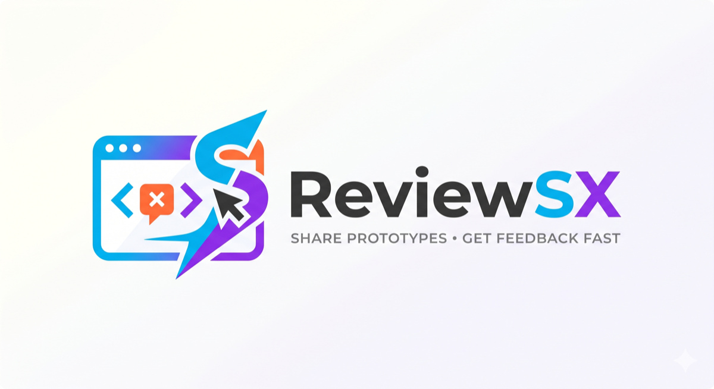

# ReviewSX — share prototypes, get feedback fast

**The 4 P's of product building:** **Prototype** → **Publish** → **Position** → **Procure feedback.**

You built a prototype. Now the hard part: getting your boss, your client, or your
team to actually *look at it and tell you what they think* — without making them
clone a repo, run a dev server, or install anything.

ReviewSX turns any running prototype into a shareable link with a built-in
feedback overlay. Reviewers open it in a browser, follow the guided tour you
authored, and click any element to leave a pinned comment. You see every comment
back in VS Code.

<!-- TODO: add a hero GIF of the full flow at images/hero.gif and uncomment:

-->

---

## The 4 P's

| | | |
|---|---|---|
| 🧩 **Prototype** | Build it however you like | Static HTML, React/Vite, Next.js — anything that runs in a browser |
| 🚀 **Publish** | One click to a shareable link | GitHub Pages, or a live tunnel link for a quick "can you look at this?" |
| 🎯 **Position** | Author a guided tour | Walk reviewers through exactly what to look at, in order |
| 💬 **Procure feedback** | Pinned comments, back in your editor | Reviewers click elements to comment; you triage in the sidebar |

---

## Why it's different

- **Zero install for reviewers.** They get a link. That's it. No account, no repo, no IDE.
- **Works on any device.** Your reviewer can be on their phone in an airport.
- **In-context feedback.** Comments are pinned to the actual UI element, not lost in a chat thread.
- **No style collisions.** The overlay renders in a Shadow DOM — it never touches your prototype's CSS.

---

## Who it's for

### 🚀 Startups & solo builders
You pushed a prototype to a public GitHub repo and it runs on localhost. Your
boss is travelling and doesn't have VS Code. **Publish to GitHub Pages**, send the
link, and feedback flows into the free hosted inbox — and into your sidebar.

### 🏢 Mid-market & enterprise
Private repo, busy reviewers who want a company-hosted link, real IP sensitivity.
Self-host the ReviewSX inbox on your own AWS/Azure (Docker Compose, bring your own
Postgres). Data never leaves your network; your reviewers just get a link.

---

## Quick start

1. Open your prototype folder in VS Code.
2. Click the **ReviewSX** icon in the activity bar.
3. **Start with overlay** → your prototype opens in the browser with the toolbar.
4. **Position:** click the ⚙ gear to author a guided tour.
5. **Publish:** click **Publish to GitHub Pages**, or the **broadcast** icon to
   share a live tunnel link.
6. **Procure:** reviewer feedback appears in the sidebar, grouped by open / resolved.

<!-- TODO: add images/sidebar.png and images/overlay.png and uncomment:

-->

---

## Sharing options

| Method | When | Reviewer sees |
|---|---|---|
| **GitHub Pages** | A stable link for async review | `username.github.io/repo` (needs a public repo, or GitHub Pro for private) |
| **Tailscale Funnel / Cloudflare tunnel** | A quick "look at this now" while it runs on your machine | A temporary public URL to your live localhost |

## Feedback inbox

| Option | Best for |
|---|---|
| **ReviewSX hosted inbox** (free) | Indie builders & startups — `inbox.reviewsx.app`, each project isolated |
| **Self-hosted** | Enterprises — Docker Compose on your own infra, your own Postgres |
| **Per-browser** | Quick solo look — no inbox; feedback stays in the reviewer's browser |

Configure via the **Set up shared inbox** button in the sidebar.

---

## Commands

| Command | What it does |
|---|---|
| `ReviewSX: Start prototype with overlay` | Serve the prototype with the overlay injected |
| `ReviewSX: Share via Tailscale Funnel` | Open a public URL to the running prototype |
| `ReviewSX: Publish to GitHub Pages` | Static-export + publish for async review |
| `ReviewSX: Set up shared inbox` | Choose hosted vs self-hosted feedback storage |
| `ReviewSX: Edit tour` | Author the guided walkthrough |

---

## Privacy & data

Your prototype's tour and your own local notes live in `.protofeedback/` in your
repo. The published copy embeds the tour so reviewers see it without an inbox, and
those local files are never published.

**Where reviewer feedback is stored depends on the inbox you choose:**

| Inbox | Where feedback lives |
|---|---|
| **ReviewSX hosted** (default, free) | On ReviewSX-operated servers (Fly.io), isolated per project by a unique key. Convenient, zero setup. |
| **Self-hosted** | Entirely on **your own** infrastructure (your AWS/Azure/Docker host + your Postgres). Nothing leaves your network. Best for private repos / IP-sensitive work. |
| **No inbox** | Only in the reviewer's own browser — it never leaves their machine (and never reaches you). |

If you need full control over where reviewer feedback is stored, self-host the
open-source inbox — see the repo's `deploy/` folder.

---

Built for the way people build now — fast prototypes that need fast feedback.
[github.com/sanketsao/ReviewsX](https://github.com/sanketsao/ReviewsX) · MIT
